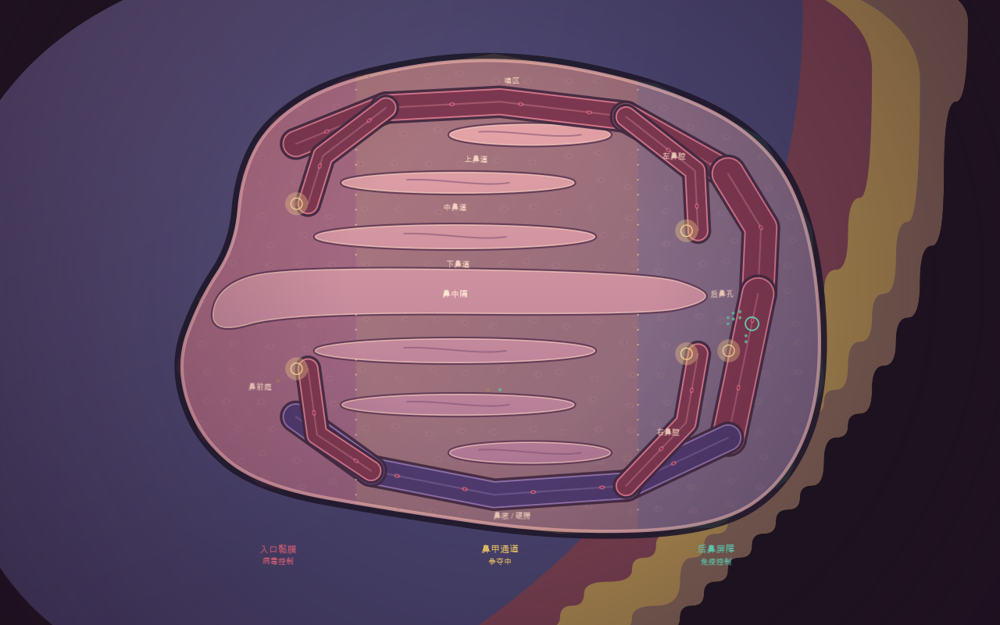

# 双侧鼻腔地形

鼻腔在现有人体面部位置展开为 216×160 格的可玩战场。参考 [鼻腔解剖](https://www.ncbi.nlm.nih.gov/books/NBK544232/) 和 [鼻甲结构](https://www.ncbi.nlm.nih.gov/books/NBK546636/) 中的鼻前庭、左右鼻腔、鼻中隔、上中下鼻甲及鼻道、嗅区、鼻底和后鼻孔关系；为了俯视操作，把左右黏膜面展开为上下两侧，比例、血管宽度和交换口为游戏调整。

采用柔和的珊瑚色黏膜、粉色鼻甲隆起、红紫血管、金色交换膜口和细胞纹理，保留现有卡通细胞和区域染色。区域仍为入口黏膜、鼻甲通道、后鼻屏障，包围真实组织面积，不通过点击旗帜占领。

鼻甲和鼻中隔形成七处真实障碍；上下鼻腔通过后鼻孔一侧的通道连接。十二段血管构成两侧侧路和四条黏膜支路，五个交换膜口允许出入。血管壁不可横穿，攻击也受鼻甲、鼻中隔和封闭管壁阻挡。黏膜可容纳编队绕行，血管用于快速调动；各路线均接入原固定步、血管通路状态和细胞碰撞规则。

第一波病毒走右鼻腔，第二波走左鼻腔，第三波同时从两侧进入，再沿所在一侧依次进攻三块区域。数量、时间、占领速度、调援和胜败条件延续鼻腔战役规则。病毒的左右路线随实体保存，读档后不会重新选择入口。

点击顶部「鼻腔图」定位整个鼻腔，滚轮或双指缩放查看局部，「回营」返回免疫调入口。人体「地图」仍展示锁定组织。全景按桌面、横屏与竖屏的 HUD 空间适配；横屏手机可见空间较小，全景用于定位，战术操作需要放大。

全身血管继续使用原人体网络绘制，鼻腔的十二段局部血管由鼻腔图层覆盖。新战役只在鼻腔寻路时使用局部网络，不能因此替换全身地图的血管显示。战役「地图」默认打开组织总览，锁定组织以暗色显示，血管仍可辨识；显示地图不会开放移动范围。

新游戏采用战役地形版本 2。旧 v6 鼻腔记录没有该字段，继续原地形、出生位置、血管规则与检查点；v1–v5 仍为原沙盒。没有修改引擎库，没有远端提交或构建。

## 验收

| 检查 | 结果 |
| --- | --- |
| 全部可行走格按真实通路状态搜索 | 20,740 / 20,740 可从调入口到达 |
| 地形、真实细胞走遍两侧、膜口、阻挡攻击、存读档、双入口、全景、全身血管保留 | [9 / 9 组](nasal-terrain-results.json) |
| 原鼻腔区域、波次、调援、胜败、重试与存档 | [15 / 15 组](nasal-results.json) |
| 原沙盒、平滑地形、血管、缩放 | 22 / 22、3 / 3、7 / 7、5 / 5 组 |
| 原 v6 鼻腔实际存档读取、续玩、再保存与重试 | [1 / 1 组](nasal-terrain-v6-results.json) |
| 桌面与手机布局、按钮回调 | [43 / 43 项](nasal-ui-results.json) |
| 三种种子分兵守卫与反攻 | [全部成功，约 320.3 秒](nasal-terrain-playthrough-results.json) |
| 撤空防线 | 约 84 秒，后鼻完全失守后失败 |

可在隔离 Lua 5.4 环境调用 `require("war.NasalTerrainAcceptance").run()`；回归不会写实际云槽位。新增代码的 Lua 语法和类型检查通过，工作区仍有原有 AI/旧回归模块的 16 条类型诊断，本轮未改写这些模块。

## 画面证据与限制

[后鼻血管与调入口](previews/nasal/terrain-rear.png) · [鼻甲间的局部战场](previews/nasal/terrain-close.png) · [桌面界面组合图](previews/nasal/terrain-hud.png)

[恢复全身血管后的组织总览](previews/nasal/body-circulation-restored.png) 同样为实际 Lua 地图绘制代码的离线渲染。

以上为实际 Lua 绘图与界面代码的离线渲染，采用示意交战单位，不是原生窗口截图，也不提供帧率证明。当前模拟通关约 5 分 20 秒，仍需真人检验触屏手感与难度。

本地运行会话已刷新并读取当前日志与检查。原有 `Cube/Day/DaySpecularHDR_QualityLow.dds` 资源缺失仍使 CLI 就绪检查报失败；另行读取本轮原始 Lua 日志已确认 `READY`，游戏脚本已启动。工具不支持窗口截图，原生画面验收尚未完成。证据见 [本地预览记录](nasal-terrain-preview-results.json)。没有自动启动已停止的预览。
